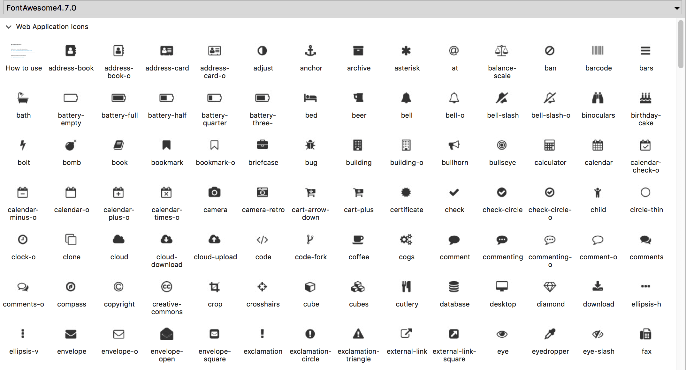

FontAwesome Axure Library 4.7
=========================

此 Library 针对 Axure 8 设计，采用 FontAwesome 4.7 版本。

## 样例

## 如何在 Axure 中使用此图标库

1. 下载 [FontAwesome字体](./fonts/FontAwesome.otf?raw=true) 并安装.

2. 点击 发布 > 生成 HTML 文档, 在弹窗中选择 Web 字体，点击添加“+”按钮.
	
	- 名称: FontAwesome
	- URL: https://maxcdn.bootstrapcdn.com/font-awesome/4.7.0/css/font-awesome.min.css
        - 中国地区用这个URL: http://cdn.staticfile.org/font-awesome/4.7.0/css/font-awesome.min.css

3. 下载[FontAwesomeV4.7.0.rplib](FontAwesome4.7.0.rplib?raw=true)，并安装。然后就可以使用了。

## 此图标库特点
-     图标尺寸为44*44，适用于APP设计和WEB设计
-     字体尺寸为20，居中显示，更适合手机APP界面设计
